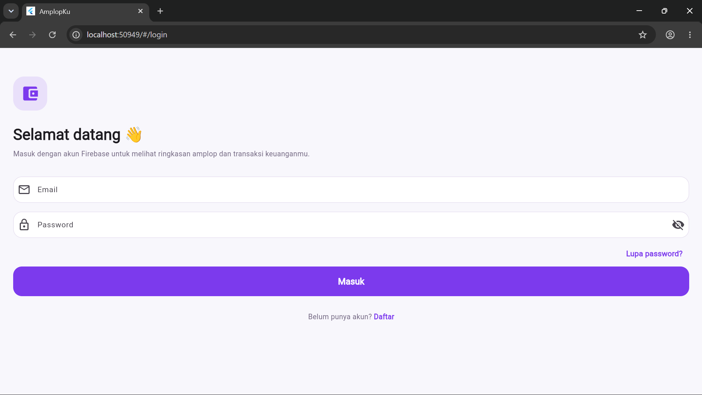

# 💜 AmplopKu

**AmplopKu** adalah aplikasi pengelolaan keuangan berbasis **Flutter** yang membantu pengguna melihat ringkasan amplop dan mencatat transaksi keuangan dalam satu aplikasi.

Aplikasi menggunakan **Firebase Authentication** untuk autentikasi pengguna dan **Cloud Firestore** untuk penyimpanan data.

## 📱 Tampilan Aplikasi

### Halaman Login



## ✨ Fitur

- Login pengguna
- Pendaftaran akun
- Lupa password
- Pengelolaan amplop keuangan
- Pencatatan transaksi
- Integrasi Firebase Authentication
- Penyimpanan data menggunakan Cloud Firestore
- Dukungan multi-platform melalui Flutter

## 🛠️ Teknologi

- Flutter
- Dart
- Firebase Authentication
- Cloud Firestore
- Firebase

## 🚀 Menjalankan Project

```bash
flutter pub get
flutter run
